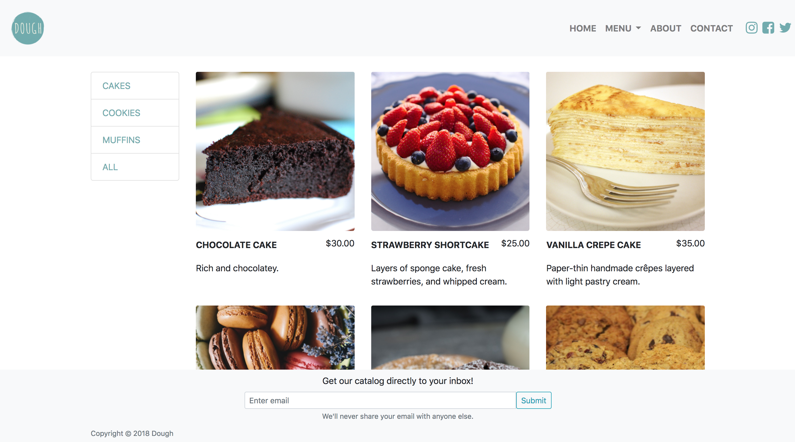
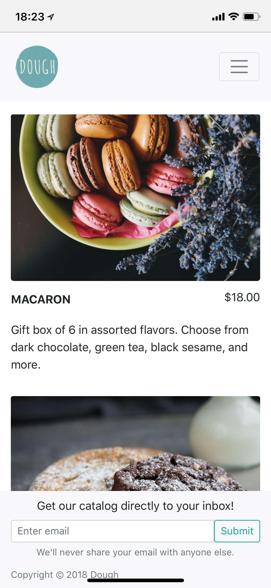

# dough
## Website for a modern fictitious bakery

## Built with:
* Ruby
* Sinatra
* SendGrid
* Bootstrap
* Sass

Desktop view:

Mobile view:

## Disclaimer
* Catalog email CTA currently does not work as intended due to lack of SendGrid API key while deployed to Heroku

## Acknowledgements
* Inspiration: [LadyM](https://www.ladym.com/home) and [Milk Bar](https://milkbarstore.com/menu/)
